# Testing different visualization techniques using the cow and armarillo

## Point cloud Visualization

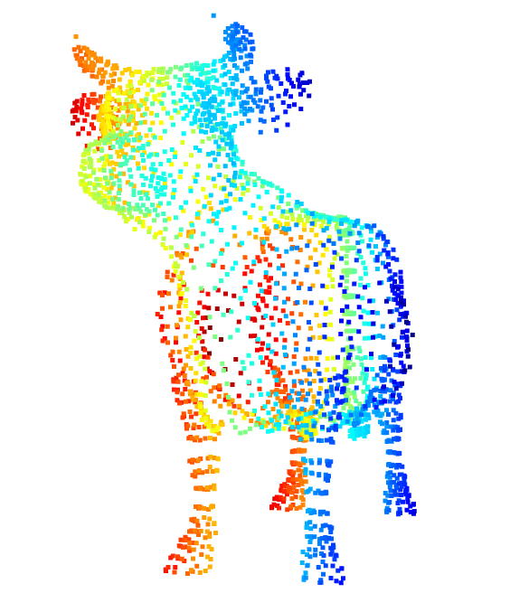

## Poisson Surface Reconstruction of armarillo

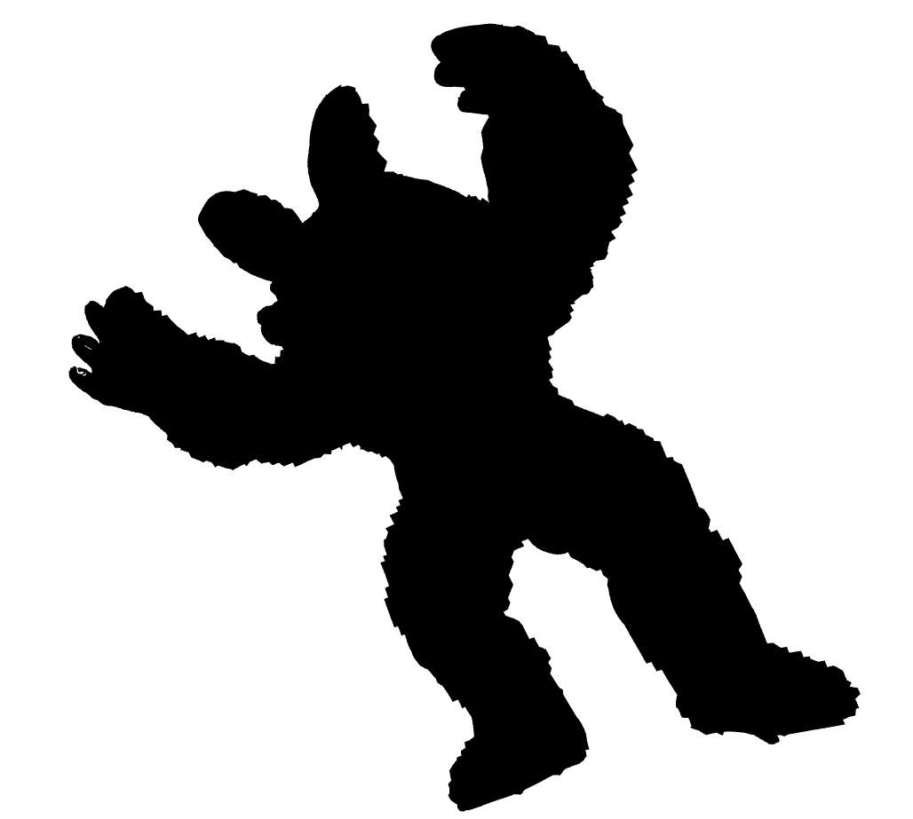

## Poisson Surface Reconstruction of cow

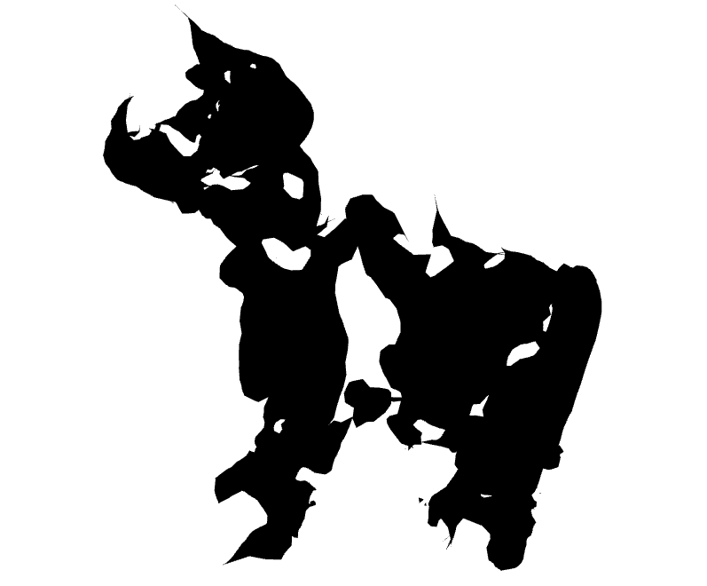

## Bill Pivot Reconstruction of cow

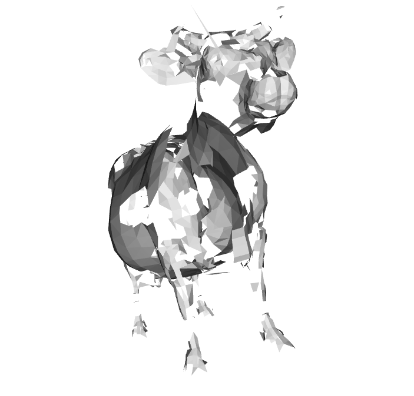

## Alpha Shapes Reconstruction of cow

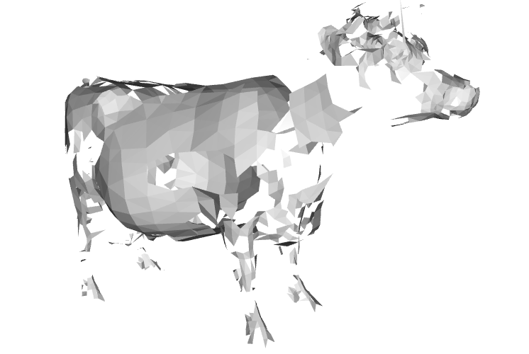

## Delaunay Triangulation of cow

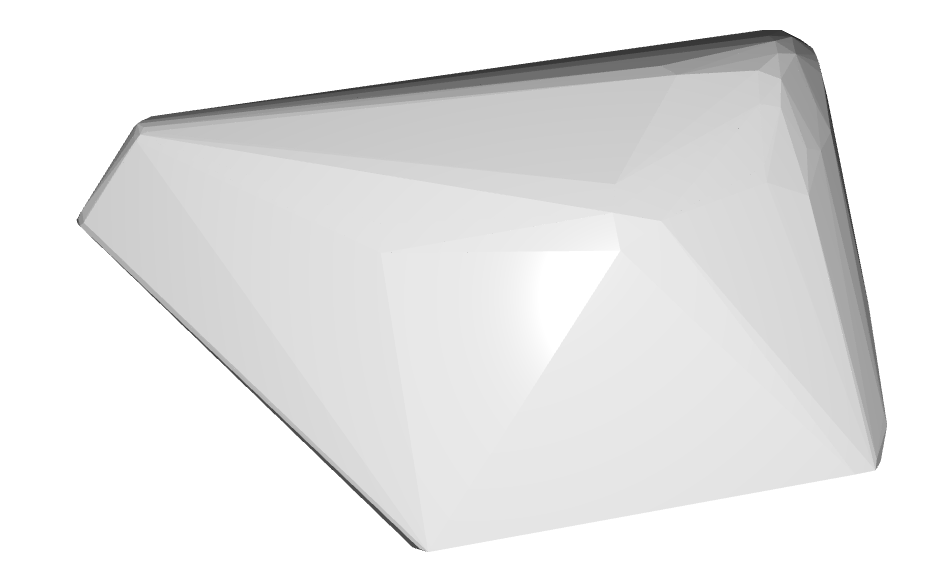

## Visualize point cloud of cow

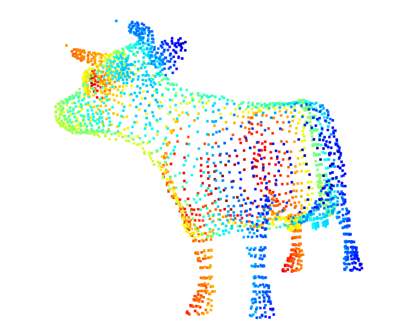

## Downsampling and outliers removal of cow's point cloud

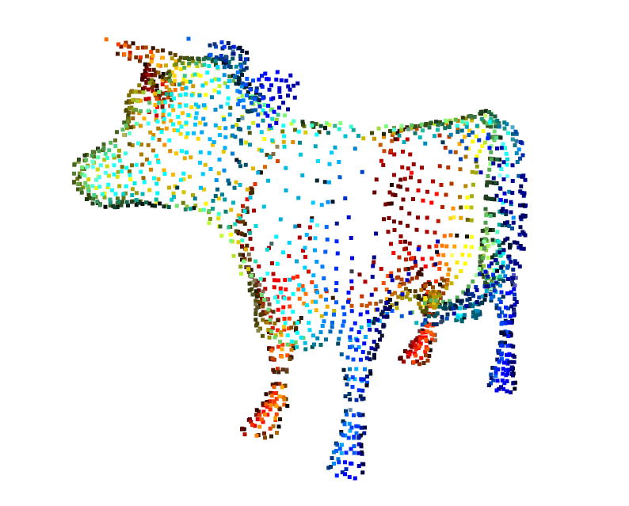

## Registration
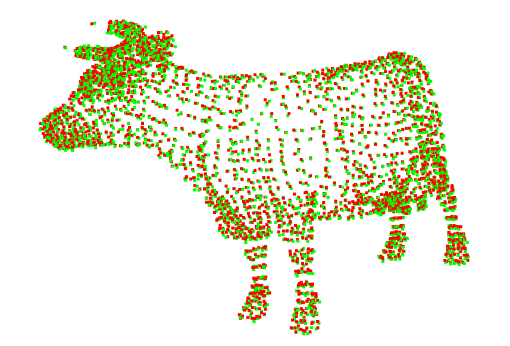
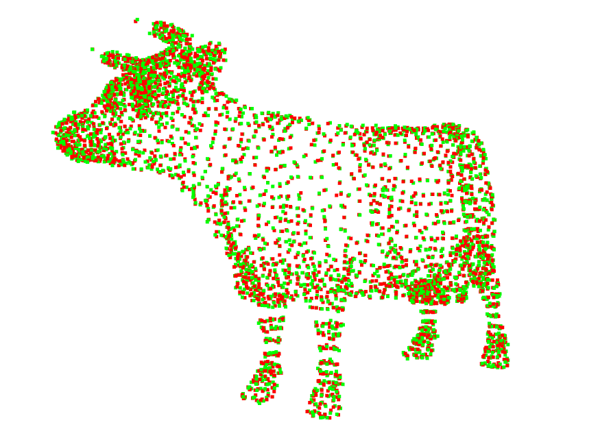
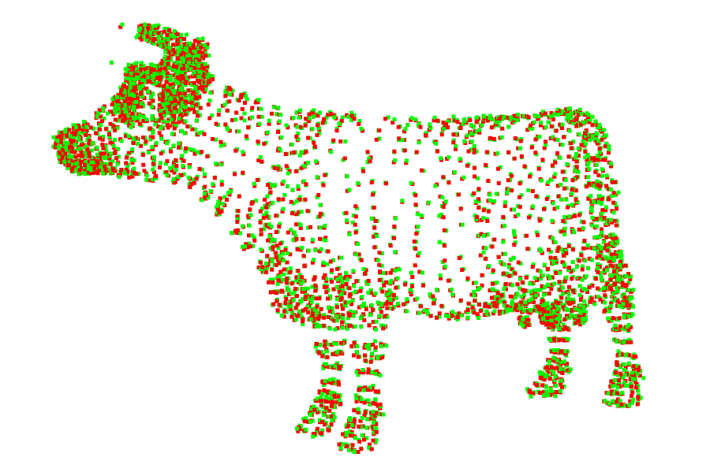
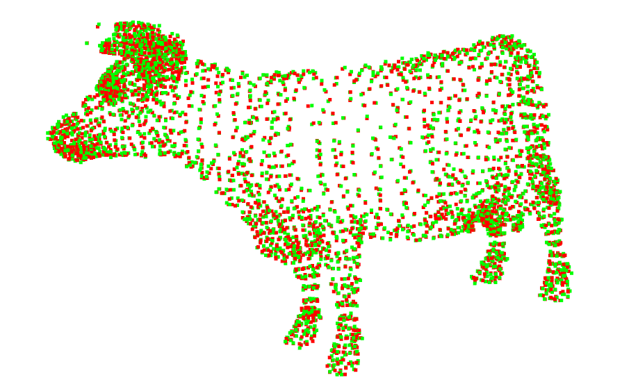

## Segmentation

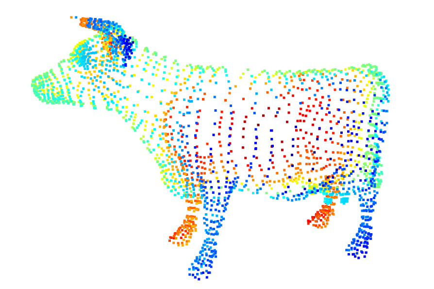

## Advanced visualization

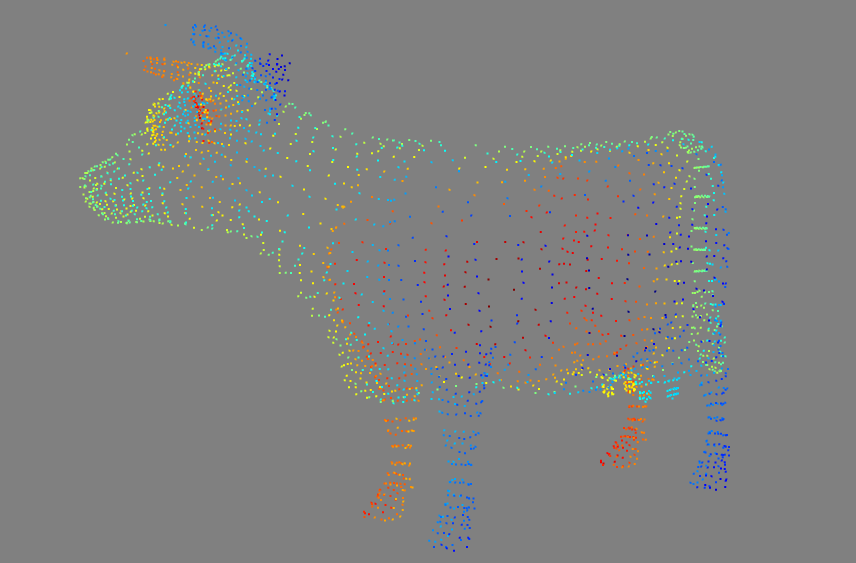

